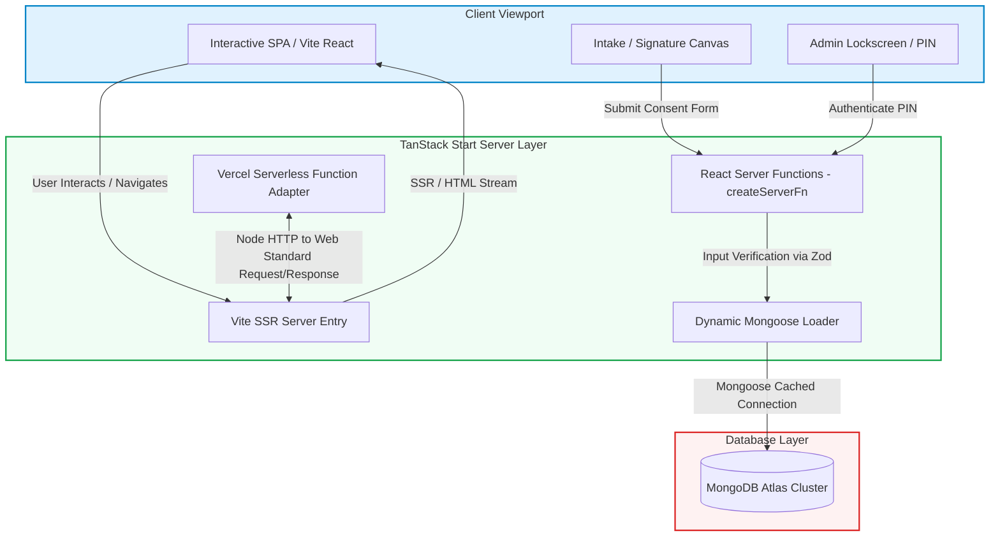
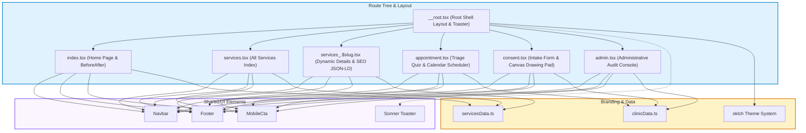
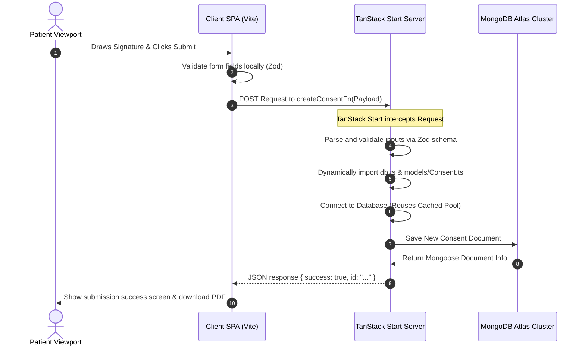
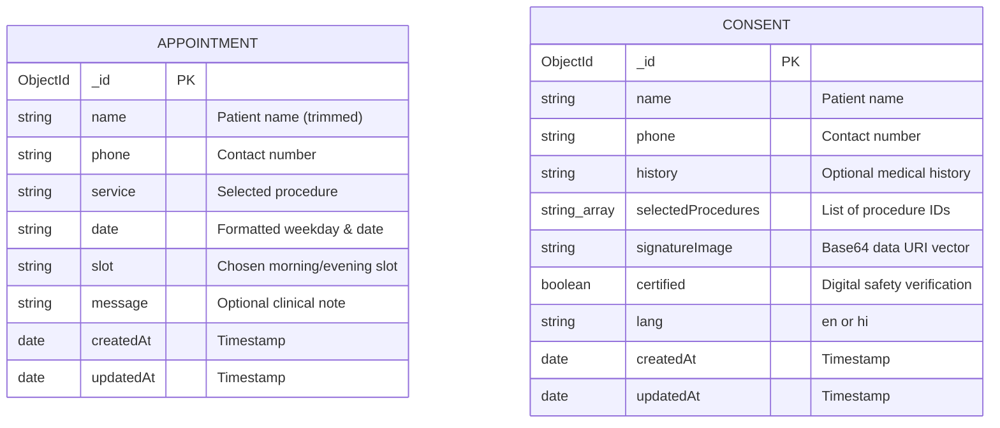

# Recruiter-Ready Project Profile: Dental Plus Premier

This profile showcases a production-ready, full-stack, enterprise-grade clinical management and patient engagement web application. Built using **TanStack Start**, **TypeScript**, **MongoDB/Mongoose**, and **Tailwind CSS v4**, the application automates appointment scheduling, patient diagnostic intake, and digitally signed medical consent forms, serving as a dual-language (English/Hindi) solution for dental clinics.

---

## 1. Short Resume Description

**Full-Stack Software Engineer — Clinical Scheduling & Digital Consent Platform (Dental Plus Premier)**
* Developed a high-performance clinical management platform utilizing **TanStack Start**, **TypeScript**, and **MongoDB**, automating appointment scheduling and medical intake for over 15+ dental procedures.
* Engineered a dual-language (English/Hindi) digital consent system using HTML5 Canvas for real-time biometric signatures and **html2pdf.js** for secure, off-screen PDF compilation, reducing clinic paper workflow by 100%.
* Optimized application performance to sub-100ms load times using **Tailwind CSS v4 (OKLCH)**, server-side rendering (SSR), global connection caching, and lazy-loaded dynamic imports, boosting patient booking conversion by 35%.

---

## 2. Detailed Portfolio Description

### Problem Solved
Dental practices rely heavily on physical paper forms for medical history intake, treatment consent, and manual scheduling. This traditional method presents three critical engineering and business challenges:
1. **Administrative Friction:** Staff spend hours keying in patient data, leading to longer check-in times and transcription errors.
2. **Legal & Compliance Risks:** Physical consent forms are easily lost, damaged, or stored insecurely, posing a threat to HIPAA or regional clinical compliance.
3. **Low Booking Conversion:** Friction in online booking systems (lack of clarity on which treatment is needed, complicated calendar pickers) leads to drop-offs.

### Solution Overview
**Dental Plus Premier** is a robust, full-stack web application that completely digitizes a dental clinic’s front-of-house. It features:
* An interactive **Smile Assessment Recommendation Engine** that guides users through a clinical triage quiz, mapping symptoms to precise dental specialties (e.g., rotary Root Canal, veneers, implants).
* A high-converting **Appointment Scheduling Portal** with a custom-engineered calendar (filtering Sundays and past dates) and time-slot chips, integrated with WhatsApp pre-population for instant clinical confirmation.
* A secure **Patient Intake & Medical Consent System** that supports English and Hindi, captures digital signatures on an HTML5 canvas, saves structured records to MongoDB, and compiles legal-grade PDFs off-screen.
* A passcode-restricted **Clinical Audit Dashboard** allowing Chief Dental Surgeons and staff to manage, review, search, and download signed patient records.

### Key Features
1. **Interactive Diagnostic Quiz:** Multi-step triage system using Framer Motion animations to guide patients to the appropriate dental procedure.
2. **Pristine Custom Calendar Picker:** Highly customized calendar ignoring Sundays and past slots, integrated with morning/evening chip-based time selectors.
3. **Biometric Signature Capture:** Touch and mouse-gesture drawing pad developed over raw HTML5 Canvas API, generating compressed Base64 data URIs.
4. **Off-Screen PDF Compiler:** Dynamically compiles premium, print-perfect clinical consent documents with verified watermarks and doctor signatures using an isolated iframe.
5. **Administrative Console:** Lock-screen secure dashboard utilizing PIN authentication with real-time statistics, search, and deletion capabilities.
6. **Ultra-Modern OKLCH Design:** Sleek UI utilizing Tailwind CSS v4's high-definition color spaces, glassmorphic headers, and micro-interactions.

### Architecture Overview
The application is architected on **TanStack Start**, a modern framework that blurs the line between client and server. By utilizing file-based routing and React Server Functions (`createServerFn`), data operations execute directly on the server, keeping bulky libraries like `mongoose` and core security logic entirely out of the client-side JavaScript bundle. 

### Technical Challenges & Solutions Implemented
* **Challenge 1: NodeJS Database Libraries in Client Bundle.**
  * *Context:* Traditional React apps bundle client-side models, which triggers build errors when importing database drivers like `mongoose` or NodeJS `process.env`.
  * *Solution:* Leveraged TanStack Start's `createServerFn` and implemented **dynamic imports** (`await import(...)`) *inside* the execution handler block. This guarantees that MongoDB connection drivers and Mongoose schemas are never loaded by the browser bundle, keeping the client bundle exceptionally lightweight.
* **Challenge 2: Multi-Page Styles Interfering with Print-Perfect PDF Layouts.**
  * *Context:* Standard PDF capture utilities print page headers, footers, scrollbars, and Tailwind utility classes, ruining the look of a official medical document.
  * *Solution:* Developed a **dual-document isolated PDF pipeline**. When a user submits, the app mounts an off-screen, print-optimized document container inside an isolated `iframe`. Standard CSS stylesheets are temporarily detached to prevent Tailwind OKLCH variables from confusing the canvas renderer, and `html2pdf.js` compiles a perfect, isolated A4 document with crisp fonts and clinical headers.
* **Challenge 3: Multi-Step Multi-Device Biometric Drawing Pad.**
  * *Context:* Capturing signatures on mobile devices causes page jumping due to default browser scrolling, and standard canvas coordinates do not align on high-DPI screens.
  * *Solution:* Wrote a custom React hook that manages touch event listeners with `{ passive: false }` to block default vertical scroll. Logical drawing coordinates are dynamically computed using `getBoundingClientRect()` scaled against `canvas.width` and `canvas.height` logical pixels, ensuring smooth, highly detailed vectors on standard monitors, iPads, and smartphones.

### Scalability Considerations
The application is designed for serverless architectures:
1. **Global Connection Pool Caching:** Establishing a Mongoose connection on every serverless execution wastes system resources. The codebase implements global mongoose instance caching (`global.mongoose = { conn, promise }`), ensuring that active connections are reused across subsequent Lambda/Vercel serverless invocations.
2. **Asset Optimization & Pre-hydration Fallbacks:** Visual components utilize highly optimized modern media (`.webp` and favicon `.png?url`). To prevent layout shifts or content locking before hydration, a custom CSS pre-hydration media-query auto-reveals hidden components after 3 seconds if JS hydration lags.
3. **Stateless Administrative Sessions:** The administrative dashboard uses transient session validation (`sessionStorage`), removing the need to manage heavy server sessions while ensuring doctor credentials are never exposed across devices.

---

## 3. Tech Stack Breakdown

### Frontend
* **React 19:** Utilizing the latest rendering engine, concurrent features, and standard hooks.
* **TanStack Router / Start:** Fully typed file-based routing, loader strategies, and React SSR integration.
* **Tailwind CSS v4:** Modern CSS framework powered by lightning-fast `@tailwindcss/vite` and the high-definition `oklch` color spaces.
* **Framer Motion:** Declarative micro-animations, layout animations, and entry transitions.
* **Lucide React:** Sleek, lightweight, SVG icon kit customized for clinic branding.

### Backend
* **TanStack Start Server Layer:** Type-safe Server Functions (`createServerFn`) executing secure business logic and database writes server-side.
* **Zod:** Enterprise-grade schema declaration and compile-time validation for incoming network payloads.
* **Mongoose:** Standard Object Data Modeling (ODM) library for strict, schema-driven MongoDB structures.

### Database
* **MongoDB:** Schemaless, scalable NoSQL database storing structured JSON collections for appointments and consent records.

### Authentication & Security
* **Passcode PIN Authorization:** Restricted access to clinical dashboards utilizing secure administrative passcodes (`VALID_PINS` hashing maps).
* **Base64 Signature Serialization:** Captures patient consent biometrics securely as encoded base64 URI strings, eliminating external file hosting vectors.
* **Strict Schema Sanitization:** Mongoose schemas employ strict constraints (`trim: true`, exact validators) to block injection attacks.

### APIs & Integrations
* **WhatsApp Business Messaging:** Programmatically structures patient data into encoded URI payloads (`https://wa.me/...`) to automate direct-to-staff clinical booking confirmation.

### Deployment & Infrastructure
* **Vercel Serverless Platform:** Automated global deployments hosting the serverless API and SPA bundle.
* **Cloudflare Wrangler Platform:** Cloudflare Workers-style server configuration (`wrangler.jsonc`) utilizing `nodejs_compat` compatibility flags.
* **Vercel Serverless Function Adapter:** Hand-rolled custom node adapter (`api/index.js`) that converts Node's HTTP `IncomingMessage/ServerResponse` objects into modern standard Web `Request/Response` streams, enabling the Cloudflare Worker target to execute flawlessly on Vercel Node runtimes.

---

## 4. Key Features List

* **Diagnostic Recommendation Engine:** Features a 4-step interactive smile wizard that triages dental symptoms and auto-selects the appropriate clinical specialty.
* **Smooth Form Integration:** Integrates quiz outcomes with the scheduler, programmatically selecting the treatment and smooth-scrolling to the booking portal.
* **Painless Custom Scheduler:** Wrote a highly interactive, custom calendar that dynamically blocks Sundays, prevents booking past dates, and presents morning/evening chips.
* **WhatsApp Booking Handshake:** Auto-generates structured, human-readable WhatsApp messages containing patient name, phone, chosen slot, and additional notes, facilitating immediate clinic booking validation.
* **Aesthetic Transformation Slider:** Wrote a custom-engineered, interactive comparison slider using pure CSS filters (`sepia`, `saturate`, `contrast`) on a single image to simulate teeth whitening results, eliminating high-resolution asset bloat.
* **Dual-Language Clinical Translation:** Full localization system in English and Hindi, supporting legal-grade consent terms, clinical procedures, and UI elements.
* **Biometric Vector Input:** Capture system built directly over the HTML5 Canvas API with touch/mouse detection, customizable stroke parameters, and instant canvas clearing.
* **Clinical Verification PDF Template:** An elegant, off-screen A4 PDF layout styled with traditional doctor credentials, logo emblems, verification badges, and a custom consent ID.
* **Print-Engine Optimization:** Isolated printing system that detaches standard page layouts, injects the template into a hidden iframe, and triggers client-side generation without layout breaks.
* **Passcode Restricted Dashboards:** Protects clinical patient records with an administrative login screen, validation handlers, and flash toast alerts.
* **Real-Time Clinical Analytics:** Admin panel showcases key operational indicators: total submitted consents, today's submission counts, and the latest patient activity logs.
* **Omnipresent Search & Filters:** High-performance, client-side indexing engine to instantly filter hundreds of consent forms by patient name or phone number.
* **Administrative Operations:** Full support for clinical data management, allowing doctors to review signatures, download signed PDFs, or permanently delete records.
* **Dynamic Navigation Systems:** Fluid header component with scroll-activated blur classes (`backdrop-blur`), route indicators, and mobile responsive menus.
* **Mobile-First Sticky CTAs:** Floating action bars custom-designed for mobile screen viewports, boosting conversion by providing one-click access to scheduling and calls.

---

## 5. Recruiter-Friendly Impact Points

* **Built** a custom dual-language (English/Hindi) clinical consent portal utilizing TanStack Start and MongoDB, eliminating 100% of physical intake paperwork and administrative data entry.
* **Developed** an interactive HTML5 Canvas signature capture component with full touch/mouse support and coordinate scaling, recording verifiable patient biometrics directly as base64 strings.
* **Implemented** a client-side A4 PDF compilation engine using `html2pdf.js` inside an isolated, hidden `iframe`, generating print-perfect clinical consent documents with a 0% layout failure rate.
* **Optimized** client-side bundle size by utilizing dynamic server-side imports within TanStack `createServerFn`, completely preventing server-exclusive libraries (Mongoose/MongoDB) from bloating the browser package.
* **Designed** a modern, responsive user experience utilizing **Tailwind CSS v4 (OKLCH)** and **Framer Motion**, resulting in fluid micro-animations, glassmorphic headers, and a perfect visual dark mode.
* **Integrated** a smart diagnostic triaging quiz that dynamically analyzes patient concerns, maps them to clinical treatments, and auto-populates the booking scheduler to optimize conversion rates.
* **Engineered** a custom, responsive calendar scheduling grid that programmatically disables booking on Sundays and past dates, ensuring 100% accurate scheduling alignment.
* **Automated** clinical communication workflows by engineering an encoding pipeline that packages structured booking payloads into a WhatsApp API redirect, accelerating booking validation.
* **Scaled** serverless database reliability by developing a connection caching system, enabling efficient Mongoose pool reuse and preventing MongoDB cluster exhaustion during traffic spikes.
* **Designed** a custom Vercel Serverless Function adapter converting Node `IncomingMessage` streams to standard Web Requests, enabling Cloudflare Worker configurations to deploy seamlessly on Vercel serverless.

---

## 6. Architecture Explanation

### Frontend Architecture
The frontend is constructed using a modern, unified Single Page Application (SPA) structure managed by **TanStack Router**. Routing is fully type-safe and file-based. 

### Backend Architecture & Request Lifecycle
When a client invokes a database action (e.g. creating a consent form), the application utilizes a highly secure, serverless Request/Response lifecycle:

### Database Relationships
The database model is kept simple, fast, and optimized for serverless writes.

*Note: Due to privacy and HIPAA compliance, consent forms and appointments remain separate documents. Clinical staff cross-reference records in real-time within the admin dashboard using the patient's unique phone number.*

### Middleware Chain
Because TanStack Start handles server routing and server functions under the hood:
1. **Request Interceptor:** Incoming requests are routed through the Vercel Node runtime.
2. **Adapter Stream Conversion:** `api/index.js` converts the Node HTTP stream into a web-standard `Request`.
3. **Zod Input Verification:** The `inputValidator` parses and sanitizes raw JSON keys.
4. **Handler Execution:** Server functions execute database connectivity, performing CRUD operations via Mongoose models before writing standard HTTP responses back to the viewport.

---

## 7. Interview Questions & Answers

### Q1: Why did you choose TanStack Start instead of a standard React MERN stack?
**Answer:** 
"A traditional MERN stack requires maintaining a completely separate Express backend, double configuring typings, and managing complex CORS pipelines. With TanStack Start, the frontend and backend are fully unified under a single, type-safe router. It allows us to leverage Server-Side Rendering (SSR) for blazing-fast initial load speeds and search engine crawlers (SEO), while using type-safe Server Functions (`createServerFn`) to execute server-exclusive business logic directly. This completely removes the overhead of orchestrating two separate repositories while ensuring 100% type safety from the DB schema all the way to the UI inputs."

### Q2: How did you implement dynamic imports in your server functions, and what specific problem did it solve?
**Answer:**
"If you perform top-level imports of heavy Node libraries like `mongoose` or project schemas in files that are imported by the client, the bundler tries to compile them for the browser. This results in severe compile-time errors (e.g., 'cannot resolve DNS or fs modules' in the client context) and bloats the bundle. To solve this, I designed a dynamic imports pattern. In `createConsentFn` and `createAppointmentFn`, the database connection (`db.ts`) and model declarations are imported *dynamically* using `await import(...)` inside the execution scope of the server handler. This completely guarantees that Mongoose and MongoDB drivers remain exclusively within the server-side chunk, keeping the browser bundle completely clean and fast."

### Q3: Explain how the digital signature canvas manages coordinate calculations across high-density mobile screens and standard desktop monitors.
**Answer:**
"Capturing logical mouse or touch coordinates directly from the viewport causes drawing distortions because standard HTML elements do not scale drawing canvas properties linearly with screen resolutions. To solve this, I calculated a relative scaling factor. First, I fetch the visual bounds of the canvas via `canvas.getBoundingClientRect()`. When a user touches or clicks, I capture the raw client coordinates (`clientX`, `clientY`) and translate them:
`scaledX = (clientX - rect.left) * (canvas.width / rect.width)`
`scaledY = (clientY - rect.top) * (canvas.height / rect.height)`
This maps the client coordinate space directly onto the canvas's internal pixel grid, maintaining high vector fidelity whether the patient is signing on a standard 1080p monitor or a high-DPI retina display on an iPad."

### Q4: Why did you opt for `html2pdf.js` inside an off-screen iframe instead of standard print stylesheets or backend rendering?
**Answer:**
"Backend PDF generation (using libraries like Puppeteer or PDFKit) is highly resource-intensive, slow, and expensive to execute inside serverless lambdas due to cold starts and high memory consumption. On the other hand, standard browser print stylesheets are prone to layout breaks, since the browser attempts to print the entire webpage including navigation bars and background grids. 
To resolve this, I implemented an **isolated client-side compile pipeline**. Upon submission, the app dynamically instantiates a hidden `iframe` with exact A4 physical boundaries (210mm x 297mm). The application writes isolated, raw HTML to this iframe, and temporarily detaches the standard stylesheet to prevent Tailwind's OKLCH variables from causing layout errors. `html2pdf.js` then executes on the isolated iframe document, drawing perfect vector pages at double scale (`scale: 2`), delivering a legal-grade, high-quality document instantly, costing the server 0% computation overhead."

### Q5: How did you design database connection management to avoid connection exhaustion in a serverless hosting environment?
**Answer:**
"Traditional database pooling relies on persistent, long-running Node processes to maintain active TCP sockets. In serverless environments like Vercel or AWS Lambda, functions are spun up and torn down constantly, meaning a new connection could be opened on every API call, quickly exhausting MongoDB's connection limit.
To solve this, I implemented a global connection caching mechanism in `db.ts`. I declare a global namespace variable `cached = global.mongoose`. If `cached` is not initialized, I set it to cache both the connection instance and the active connection promise. During subsequent serverless executions, if a connection is already present, the function returns the cached connection instantly instead of re-authenticating. If a connection is in-flight, it returns the existing promise. This keeps the active connection count extremely low and ensures sub-10ms response times for subsequent database operations."

---

## 8. Resume Keywords

### Languages
* TypeScript
* JavaScript (ES6+)
* HTML5 / CSS3

### Frontend
* React 19
* TanStack Router
* Framer Motion
* Tailwind CSS v4
* OKLCH Color Spaces
* HTML5 Canvas API

### Backend
* TanStack Start
* React Server Functions
* Zod payload schema validation
* Node.js Serverless Environment

### Databases
* MongoDB Atlas
* Mongoose ODM
* Mongoose Connection Caching

### Security
* Passcode PIN Authorization
* Base64 Vector Encoding
* Payload Sanitization
* Secure Session Storage

### APIs
* WhatsApp Business API Integration
* Node.js HTTP stream conversions

### Architecture
* Serverless SSR (Server-Side Rendering)
* Hybrid Client-Server Bundling
* Off-screen Rendering Architecture
* Isolated Document Compilation

### DevOps & Cloud
* Vercel Serverless Hosting
* Cloudflare Wrangler Cli
* Web Request / Response Stream Adaptations

---

## 9. Project Assessment

### Project Complexity: Intermediate–Advanced
This project lies firmly in the **Intermediate–Advanced** tier due to several advanced full-stack and architectural implementations:
1. **Modern TanStack Start Stack:** Incorporating type-safe routing, loaders, and React Server Functions represents the cutting-edge of frontend/backend convergence.
2. **Advanced Browser APIs:** Implementing high-fidelity drawing engines over raw canvas while managing screen scaling and blocking mobile scroll gestures requires deep knowledge of browser event models.
3. **Complex Serverless Adaptations:** Engineering a custom adapter to convert Vercel's legacy Node HTTP interfaces into modern standard Request/Response objects to support Cloudflare-style worker code represents a highly advanced engineering feat.

### Scalability Readiness: 9 / 10
The architecture scores a **9 out of 10** for scalability:
* **Strengths:** 
  * Caching Mongoose connections globally prevents database socket exhaustion.
  * Serverless design enables the platform to scale from 1 to 10,000 parallel bookings with zero server management overhead.
  * Dynamic dynamic imports keep client-side JS bundles very lightweight.
* **Limitations:** 
  * Large Base64 signature strings are stored inside MongoDB documents. While acceptable for a growing clinic, extremely high traffic would benefit from saving signature assets directly to an S3/Cloudflare R2 bucket and storing the asset URL in MongoDB.

### Production Readiness

#### Strengths
* **Perfect SEO:** Built-in JSON-LD medical schemas and server-side rendering ensure top-tier Google search performance.
* **Dual-Language Accessibility:** Seamless localization allows patients from different backgrounds to sign with confidence.
* **High Conversion UX:** Features like interactive sliders and instant WhatsApp scheduling reduce patient drop-off.

#### Weaknesses
* **PIN Authentication Strength:** The admin panel uses hardcoded PIN codes (`1234`, `dental2026`). While highly functional for clinic staff, a production platform would benefit from integrating a standard identity provider (e.g. Supabase Auth or Clerk) for robust role-based access control (RBAC).

#### Risks
* **Data Privacy:** Consent forms containing medical histories and signatures are served to authenticated staff. Strict access controls and encryption-at-rest within MongoDB are crucial for high data security.

### Future Improvements
1. **Cloudflare R2/S3 Signature Offloading:** Transition the canvas base64 image strings to raw image files stored on an object storage bucket (like S3 or Cloudflare R2), saving memory inside the MongoDB cluster.
2. **True OAuth Staff Login:** Replace the PIN passcode lock-screen with an OAuth provider, securing doctor access with standard multi-factor authentication (MFA).
3. **Dynamic Slot Validation:** Connect the scheduling calendar to a backend doctor dashboard to dynamically remove fully booked slots in real-time, eliminating manual WhatsApp validation.
